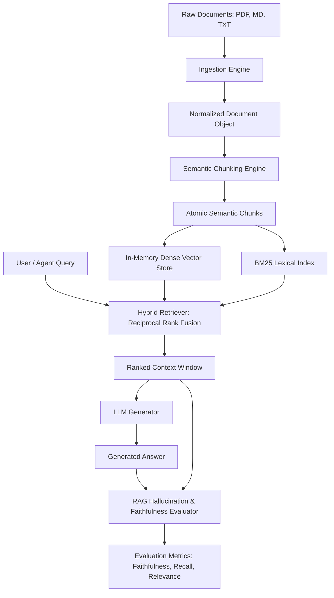

# doc-intelligence Architecture Blueprint

## System Architecture

## Module Structure
- `doc_intelligence.models`: Core data classes (`Document`, `Chunk`, `QueryResult`, `EvaluationReport`).
- `doc_intelligence.ingestion`: Parsers for structured and unstructured formats with metadata extraction.
- `doc_intelligence.chunking`: Boundary-aware semantic chunker with token budget constraints.
- `doc_intelligence.retrieval`: Hybrid retrieval combining dense vector similarity and BM25 keyword matching.
- `doc_intelligence.evaluation`: Verifiable RAG evaluation metrics without external proprietary APIs.
- `doc_intelligence.api`: Async FastAPI application with OpenAPI documentation.
